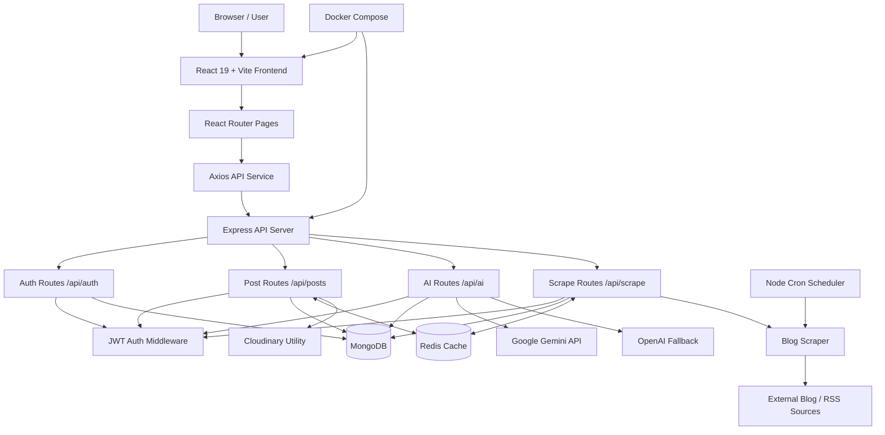

# ThinkInk

ThinkInk is a full-stack AI blogging and content aggregation platform. It combines a React/Vite frontend, an Express/MongoDB API, JWT authentication, AI writing and summarization, Redis-backed caching, and scheduled blog scraping.

The app supports two main workflows:

- Authenticated users can sign up, write rich-text posts, generate AI-assisted content, like/save/comment on posts, and summarize posts.
- The backend can scrape external blog sources, cache trending scrape results, persist scraped posts, and expose demo/public feeds.

## Architecture



## Tech Stack

| Layer | Tools |
| --- | --- |
| Frontend | React 19, Vite, React Router, Mantine, TipTap, Axios, Framer Motion |
| Backend | Node.js, Express, Mongoose, JWT, bcrypt, Multer |
| Database | MongoDB |
| Cache | Redis with graceful fallback when unavailable |
| AI | Google Gemini, optional OpenAI fallback |
| Scraping | Axios, Cheerio, RSS Parser, Puppeteer dependency, node-cron scheduler |
| Deployment | Docker, Docker Compose, Nginx frontend proxy, Vercel/Render-ready config |

## Repository Layout

```text
.
├── README.md
├── package.json                 # Root-level leftover/shared frontend animation deps
└── thinkink/
    ├── package.json             # Main app scripts
    ├── dev-start.js             # Starts backend then frontend locally
    ├── docker-compose.yml       # Frontend + backend containers
    ├── backend/
    │   ├── server.js            # Express app bootstrap
    │   ├── config/db.js         # Mongo connection helper
    │   ├── controllers/         # Auth, post, summary logic
    │   ├── routes/              # /api/auth, /api/posts, /api/ai, /api/scrape
    │   ├── models/              # User and Post Mongoose schemas
    │   ├── middleware/          # JWT protection and upload middleware
    │   ├── utils/               # Redis, Gemini, Cloudinary helpers
    │   ├── jobs/                # Scheduled scraper job
    │   └── scripts/scrapers/    # Blog scraper implementation
    └── frontend/
        ├── src/App.jsx          # Frontend route tree
        ├── src/config.js        # API base URL resolver
        ├── src/services/api.js  # Axios API wrapper
        ├── src/context/         # Auth context
        ├── src/pages/           # Route-level UI
        └── src/components/      # Shared and protected UI components
```

## Backend Overview

The backend starts in `thinkink/backend/server.js`.

Startup responsibilities:

- Loads `.env.local` first, then `.env`.
- Connects to MongoDB.
- Initializes Redis non-blockingly, so the app still runs without Redis.
- Configures CORS for local frontend, deployed frontend, and optional `ALLOWED_ORIGINS`.
- Mounts API route groups under `/api`.
- Starts the scraper scheduler every 6 days.
- Listens on `PORT` or `5000`.

Primary route groups:

| Route | Purpose |
| --- | --- |
| `GET /api/health` | Health check |
| `/api/auth` | Signup, login, current user |
| `/api/posts` | CRUD posts, user posts, saved posts, likes, comments |
| `/api/ai` | AI content generation and post summarization |
| `/api/scrape` | Scrape source status, trending scrape, custom URL scrape, cache clearing |

## Frontend Overview

The frontend starts in `thinkink/frontend/src/App.jsx`.

Key pieces:

- `AuthProvider` stores JWT state in `localStorage` and loads the current user from `/api/auth/me`.
- `ProtectedRoute` guards dashboard, post creation, profile, post detail, and edit routes.
- `src/services/api.js` centralizes auth, post, AI, save, like, and summary API calls.
- `src/config.js` resolves the API URL based on environment:
  - Local Vite dev: `http://localhost:5000/api`
  - Docker production build: `/api`, proxied by Nginx to the backend container
  - Hosted frontend: `VITE_API_BASE_URL`, for example a Render backend URL

Main frontend routes:

| Route | Access | Purpose |
| --- | --- | --- |
| `/` | Public | Home page |
| `/login` | Public | Login |
| `/signup` | Public | Signup |
| `/demo` | Public | Demo feed |
| `/demo/posts/:id` | Public | Demo post detail |
| `/blog/:id` | Public | Blog detail page |
| `/dashboard` | Protected | User dashboard |
| `/create-post` | Protected | Rich-text editor and AI content assistant |
| `/profile` | Protected | User profile |
| `/posts/:id` | Protected | Post detail |
| `/posts/:id/edit` | Protected | Edit post |

## Data Model

### User

`thinkink/backend/models/userModel.js`

- `username`
- `email`
- `password`
- `saved[]` references to `Post`
- timestamps

### Post

`thinkink/backend/models/Post.js`

- `title`
- `content`
- `summary`
- `summaryAt`
- `author` reference to `User`
- `image`
- embedded `comments[]`
- `likes[]` references to `User`
- timestamps

## Caching Strategy

Redis is optional and enabled when `REDIS_URL` or `REDISCLOUD_URL` is present.

Current cache usage:

| Cache Key | Used By | TTL |
| --- | --- | --- |
| `posts:feed` | Recent post feed for `GET /api/posts?limit=...` | 30 minutes |
| `posts:item:<id>` | Single post lookup | 1 hour |
| `scrape:trending:<limit>:<sources>` | Trending scraper results | 6 hours |
| `scrape:urls:<hash>` | Custom URL scraper results | 12 hours |

Write operations invalidate relevant post cache keys. Scraper routes can also clear scrape cache through `DELETE /api/scrape/cache`.

## AI Flow

Content generation:

1. Frontend calls `POST /api/ai/generate`.
2. Backend tries Gemini `gemini-1.5-flash`.
3. Backend falls back to Gemini `gemini-pro`.
4. If configured, backend can fall back to OpenAI models.

Summarization:

1. Frontend calls `POST /api/ai/summarize` with a `postId`.
2. Backend loads the post from MongoDB.
3. If a summary already exists and `force` is not set, the stored summary is returned.
4. Otherwise, content is chunked, summarized through Gemini, combined, and saved back to the post.

## Scraping Flow

The scraper can be triggered manually or by the scheduler.

- `GET /api/scrape/status` returns scraper health.
- `GET /api/scrape/sources` lists configured sources.
- `POST /api/scrape/trending` scrapes configured sources and can save results to MongoDB.
- `POST /api/scrape/urls` scrapes a provided URL list.
- `GET /api/scrape/recent` returns in-memory recent scrape results.
- `DELETE /api/scrape/cache` clears in-memory and Redis scrape cache.

Protected scraping endpoints require a JWT.

## Environment Variables

Create `thinkink/backend/.env` or `thinkink/backend/.env.local`.

```env
PORT=5000
MONGO_URI=your_mongodb_connection_string
JWT_SECRET=your_jwt_secret

REDIS_URL=your_redis_url
# or
REDISCLOUD_URL=your_redis_cloud_url

GEMINI_API_KEY=your_gemini_api_key
OPENAI_API_KEY=optional_openai_fallback_key

CLOUDINARY_CLOUD_NAME=your_cloudinary_name
CLOUDINARY_API_KEY=your_cloudinary_key
CLOUDINARY_API_SECRET=your_cloudinary_secret

ALLOWED_ORIGINS=http://localhost:5173,https://your-frontend.example.com
```

Frontend hosting can use:

```env
VITE_API_BASE_URL=https://your-backend.example.com/api
```

## Local Development

Install everything from the main app directory:

```bash
cd thinkink
npm run install:all
```

Start both frontend and backend:

```bash
npm run dev
```

Or run each side separately:

```bash
npm run dev:backend
npm run dev:frontend
```

Default local URLs:

- Frontend: `http://localhost:5173`
- Backend: `http://localhost:5000`
- Health check: `http://localhost:5000/api/health`

## Docker

From `thinkink/`:

```bash
docker compose up --build
```

Docker services:

- Frontend container serves the Vite build with Nginx on `5173:80`.
- Nginx proxies `/api/*` requests to `backend:5000`.
- Backend runs `node server.js`.
- MongoDB and Redis containers are currently documented as optional/commented because the app expects external MongoDB and Redis URLs by default.

## Useful Scripts

From `thinkink/`:

| Command | Description |
| --- | --- |
| `npm run dev` | Start backend and frontend together |
| `npm run dev:backend` | Start backend with nodemon |
| `npm run dev:frontend` | Start Vite frontend |
| `npm run install:all` | Install root, frontend, and backend dependencies |
| `npm run build` | Build frontend |
| `npm start` | Start backend |

Frontend-only scripts live in `thinkink/frontend/package.json`.

Backend-only scripts live in `thinkink/backend/package.json`.

## Notes From Code Analysis

- The backend currently calls both `connectDB()` and `mongoose.connect(...)` in `server.js`, so Mongo connection logic is duplicated.
- `uploadMiddleware.js` uses memory storage, while `utils/cloudinary.js` defines a Cloudinary upload helper. The current post creation controller reads `image` from `req.body`, so uploaded file handling may need wiring if image uploads should go to Cloudinary.
- Redis is implemented defensively: cache failures should not break normal API behavior.
- The root `package.json` contains only a few animation/Spline dependencies; the main runnable app is inside `thinkink/`.

## Author

Prashant Singh

